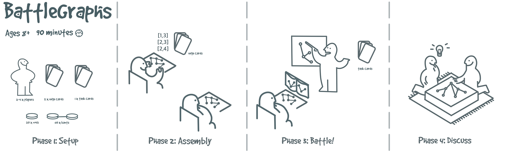

# Battlegraphs Card Generator



Battlegraphs Card Generator is a tool for creating custom cards for the Battlegraphs game. Easily generate, customize, and export cards for your own decks.

## About

**Battlegraphs Card Generator** is part of the game *BattleGraphs: Forge, Fortify, and Fight in the Network Arena*, submitted to the [EuroVis 2025 Workshop on Visualization Play, Games, and Activities (VisGames)](https://visgames2025.netlify.app/).

> **Abstract**  
> Constructive visualization enables users to create personalized data representations and facilitates early insight generation and sensemaking. Based on NODKANT, a toolkit for creating physical network diagrams using 3D printed parts, we define a competitive network physicalization game: BattleGraphs. In BattleGraphs, two players construct networks independently and compete in solving network analysis benchmark tasks. We propose a workshop scenario where we deploy our game, collect strategies for interaction and analysis from our players, and measure the effectiveness of the strategy with the success of the player to discuss in a reflection phase. Printable parts of the game, as well as instructions, are available through the Open Science Framework at https://osf.io/x6zv7/.

## Installation

```bash
git clone https://github.com/velitchko/battlegraphs.git
cd battlegraphs
npm install
```

## Usage

Start the development server:

```bash
npm start
```

Open your browser and navigate to `http://localhost:8080` to use the card generator.


## Customizing Edges and Tasks

You can customize the edges and tasks used in the card generator by replacing the contents of the `tasks.csv` and `kants.csv` files.  
**Note:** The new files should follow the same format as the originals to ensure compatibility.


## Contributing

Contributions are welcome! Please open issues or submit pull requests for new features or bug fixes.

## Citation

If you use BattleGraphs or this card generator in your work, please cite:

```bibtex
@inproceedings{ehlers2025battlegraphs,
  title     = {BattleGraphs: Forge, Fortify, and Fight in the Network Arena},
  author    = {Ehlers, Henry and Pahr, Daniel and di Bartolomeo, Sara and Stoiber, Christina and Filipov, Velitchko},
  booktitle = {Workshop on Visualization Play, Games, and Activities (VisGames), EuroVis 2025},
  year      = {2025},
  url       = {https://osf.io/x6zv7/}
}
```

## Authors

<table>
  <tr>
    <td align="center">
      <a href="https://github.com/henry-ehlers">
        <br/>
        <sub><b>Henry Ehlers</b></sub>
      </a>
    </td>
    <td align="center">
      <a href="https://github.com/dpahr">
        <br/>
        <sub><b>Daniel Pahr</b></sub>
      </a>
    </td>
    <td align="center">
      <a href="https://github.com/picorana">
        <br/>
        <sub><b>Sara di Bartolomeo</b></sub>
      </a>
    </td>
    <td align="center">
      <a href="https://github.com/NChristina">
        <br/>
        <sub><b>Christina Stoiber</b></sub>
      </a>
    </td>
    <td align="center">
      <a href="https://github.com/velitchko">
        <br/>
        <sub><b>Velitchko Filipov</b></sub>
      </a>
    </td>
  </tr>
</table>
